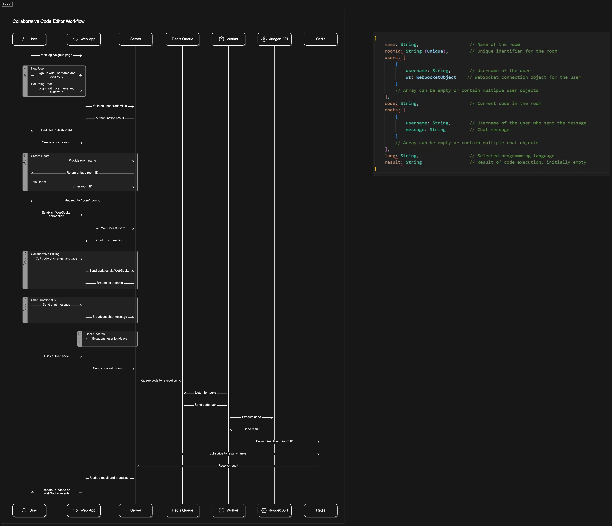

# System Design



# 🎉 Collaborative Code Editor

Welcome to the Collaborative Code Editor (CCE) repository! This application allows multiple users to collaboratively write and edit code in real-time, leveraging the power of WebSockets. Users can sign up or log in with a unique username, create or join rooms with unique room IDs, and interact with other users through real-time chat and code editing. Each room supports multiple users who can collaboratively write code, select the programming language, submit their code for execution, and view the results together. The backend handles code execution using the Judge0 API and Redis for task queuing and pub/sub functionality. This makes CCE an ideal platform for collaborative coding sessions, educational environments, and coding competitions.

## 🌟 Features
- **🔒 User Authentication**: Sign up and log in with unique usernames.
- **🛏️ Room Management**: Create or join rooms with unique IDs.
- **📝 Real-time Collaboration**: Code and chat in real-time with other users in the room.
- **🌐 Multi-language support**: Choose the programming language for your code, supports 4 languages (python,javascript,java,c++)
- **🚀 Code Submission and Execution**: Submit code and view results using the Judge0 API.
- **🔄 Real-time Updates**: Automatic updates for code changes, language selection, user activity, and chat messages.

## 🛠️ Tech Stack
- **Frontend**: Vite, React, TypeScript
- **Backend**: Express, HTTP for WebSockets, MongoDB
- **Queue and Pub/Sub System**: Redis

## 📦 Setup Guide

### Using Docker
1. **Clone the repository**:
    ```sh
    git clone https://github.com/yourusername/collaborative-code-editor.git
    cd collaborative-code-editor
    ```

2. **Create a `.env` file** in each folder and configure your environment variables:
    ```env
    # Example Client .env file
	    VITE_REACT_APP_SERVER_URL =
    # Example Server .env file
	    MONGO_URL =
	# Example Worker .env file
		//judge0 api key
		X_RAPID_API_KEY = 
    ```

3. **Build and start the application**:
    ```sh
    docker-compose up --build
    ```

4. **Access the application**:
    - Open your browser and go to `http://localhost:8080` for the server service.
    - Go to `http://localhost:5173` to access the client interface.

### Manual Setup
1. **Clone the repository**:
    ```sh
    git clone https://github.com/yourusername/collaborative-code-editor.git
    cd collaborative-code-editor
    ```

2. **Install dependencies for each service**:
    ```sh
    # Server
    cd server
    npm install

    # Worker
    cd ../worker
    npm install

    # Client
    cd ../client
    npm install
    ```

3. **Create a `.env` file** in each service directory and configure your environment variables as needed.

4. **Start each service**:
    ```sh
    # In separate terminals or use tmux/screen
    # Start Redis
    redis-server

    # Start Server
    cd server
    npm start

    # Start Worker
    cd ../worker
    npm start

    # Start Client
    cd ../client
    npm start
    ```

## 🚀 How It Works
1. **Sign Up / Log In**: Users sign up or log in with a unique username.
2. **Create / Join Room**: Users can create a new room with a unique room ID or join an existing room.
3. **WebSocket Connection**: Upon joining a room, a WebSocket connection is established.
4. **User Mapping**: On the server, the username is mapped to the WebSocket connection and added to the room's users array.
5. **Code Editor**: Users can write and edit code in a collaborative editor with a language selection option.
6. **Submit Code**: When a user submits code, it is pushed to a Redis queue.
7. **Worker Processing**: A worker listens to the queue, processes the code using the Judge0 API, and publishes the result to Redis.
8. **Result Broadcasting**: The main server subscribes to the result channel and broadcasts the result to all clients in the room.

## 🎨 Room Structure
- **Name**: The name of the room.
- **Room ID**: A unique identifier for the room.
- **Users**: An array of user objects `{username, wss}`.
- **Code**: The current code in the editor.
- **Chats**: An array of chat objects `{username, message}`.
- **Language**: The selected programming language.
- **Result**: The result of the last code execution.

## 📬 Contributing
We welcome contributions to the Collaborative Code Editor! To contribute:
1. Fork the repository.
2. Create a new branch (`git checkout -b feature/your-feature-name`).
3. Make your changes.
4. Commit your changes (`git commit -m 'Add some feature'`).
5. Push to the branch (`git push origin feature/your-feature-name`).
6. Open a Pull Request.

Please ensure your code follows our coding standards and includes tests where applicable.

## 📄 License
This project is licensed under the MIT License. See the [LICENSE](LICENSE) file for more details.
